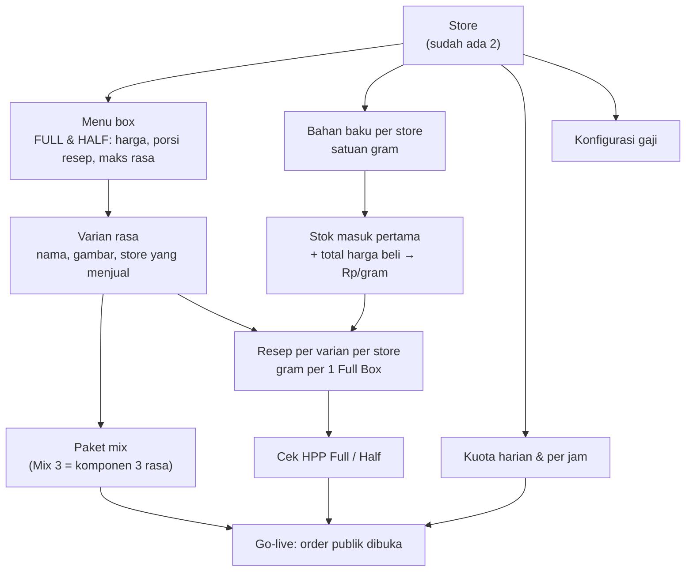
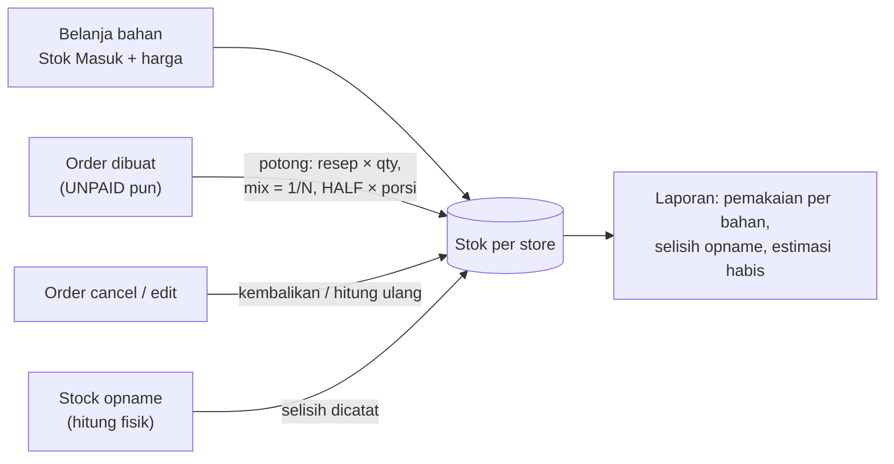

# Plan: setup dari nol — flow stok & halaman CRUD master data

**Status:** langkah 1 ✅, halaman `/config` baru ✅ (mencakup langkah 2–4), hardcode frontend dihapus ✅. Langkah 5–7 belum. Lihat "Progres" di bawah.

## Kondisi sekarang (produksi, setelah pembersihan 2026-09-25)
- **Kosong:** menu, variant, paket mix, stock, stock_history, resep, orders, order_items, pengeluaran, salary_config, daily_salary, daily_quota, hourly_quota.
- **Ada:** 2 store (Pancoran, Depok; rekening sudah terisi), 3 user role, 1 push subscription.
- Artinya halaman order publik belum bisa dipakai sampai menu, varian, dan kuota diisi.
- **Celah UI:** menu dan varian **tidak bisa dibuat atau dihapus** dari UI (hanya bisa diedit harga/ketersediaan). Store tidak bisa dibuat.

## 0. Aturan produk: box & rasa (dikonfirmasi user)

| Box | Kode di DB (`menu.name`, `order_items.box_type`) | Label di UI | Maks rasa | Porsi resep |
|---|---|---|---|---|
| Box kecil | `HALF` | "Box Kecil" / "Half Box" | **1** | 0.5 × resep Full Box |
| Box normal/besar | `FULL` | "Box Besar" / "Full Box" | **3** (campur bebas 1–3 rasa) | 1 × resep |

Contoh varian: Choco, Choco Cheese, Vanila, Vanila Cheese, Choco Oreo. Setiap varian adalah **rasa tersendiri dengan resepnya sendiri**. "Choco Cheese" bukan campuran Choco + Cheese.

### Apakah DB & kode sekarang sudah sesuai?

| Aturan | Status | Di mana |
|---|---|---|
| 2 jenis box, FULL & HALF | ✅ | `menu` (1 baris per box, termasuk harga) dan constraint `order_items.box_type` |
| Rasa per item order, bisa lebih dari 1 | ✅ | `order_item_variants` (1–N `variant_id` per item). `order_items.name` = label, misalnya "Mix Choco Dan Vanila" |
| HALF maks 1 rasa, FULL maks 3 | ⚠️ **kolomnya ada, nilainya hilang** | `menu.max_flavors`. Seed migration (FULL = 3, HALF = 1) ikut terhapus saat tabel `menu` dikosongkan. Default kolomnya **1**, jadi FULL yang dibuat ulang hanya boleh 1 rasa |
| Porsi HALF = setengah resep | ⚠️ **sama** | `menu.box_multiplier`, default **1.00**. HALF yang dibuat ulang akan memotong stok seperti Full Box |
| Batas rasa dicek di server | ✅ | `checkVariantSelection`: jumlah ≤ `max_flavors`, rasa tidak boleh dobel, rasa harus aktif |
| Campur N rasa → tiap rasa 1/N resep | ✅ | `computeBoxCost`. Contoh: FULL Choco + Vanila → 50% resep Choco + 50% resep Vanila |
| Kuota: HALF = 0.5 box | ✅ | `BOX_UNITS_SQL` / `boxUnits` |
| Frontend dan backend memakai batas yang sama | ⚠️ | Frontend fallback FULL = 3 kalau `max_flavors` kosong, backend fallback 1. Jadi UI bisa mengizinkan 3 rasa lalu ditolak saat submit |

**Kesimpulan:** struktur tabel sudah sesuai. Yang perlu diperbaiki adalah **nilai default** saat box dibuat ulang, dan fallback yang tidak sinkron.

### Perbaikan (masuk langkah 1)
1. `POST /menu`: nama wajib `FULL` atau `HALF` dan unik. Default diisi otomatis sesuai jenis box: FULL → `max_flavors = 3`, `box_multiplier = 1`; HALF → `max_flavors = 1`, `box_multiplier = 0.5`. Admin tetap bisa mengubahnya.
2. Satu sumber batas default di backend (`DEFAULT_BOX_RULES`), dipakai oleh `loadVariantCatalog` dan `getBoxMultiplier`. Frontend `maxFlavorsFor` memakai angka yang sama (FULL 3, HALF 1).
3. Validasi `PUT /menu/:id`: HALF tidak boleh `max_flavors > 1` (sesuai aturan produk "box kecil hanya 1 rasa").
4. Paket preset (`variant_components`, dulu untuk "Mix 3") **tidak diperlukan** lagi, karena FULL sudah bisa campur bebas sampai 3 rasa. Usul: sembunyikan dari UI (tabel dan kodenya tetap ada, tidak dipakai). Lihat keputusan no. 7.

### Contoh isi awal (setelah halaman menu & varian jadi)
| Tabel | Isi |
|---|---|
| `menu` | FULL: harga (mis. Rp 65.000), maks 3 rasa, porsi 1 · HALF: harga (mis. Rp 35.000), maks 1 rasa, porsi 0.5 |
| `variant` | Choco, Choco Cheese, Vanila, Vanila Cheese, Choco Oreo (aktif di store 1 & 2) |
| `stock` (per store) | mis. Tepung, Pisang, Cokelat, Keju, Vanila, Oreo (gram) |
| `variant_recipe` (per store) | gram per 1 Full Box, mis. Choco Cheese = Cokelat 30 g + Keju 20 g + … |

Contoh order dan potong stoknya:
- **HALF Vanila Cheese × 2:** stok dipotong 2 × 0.5 × resep Vanila Cheese.
- **FULL Mix Choco + Choco Oreo + Vanila × 1:** stok dipotong ⅓ resep masing-masing rasa.

## 1. Flow setup awal (sekali, berurutan)

Setiap langkah punya halaman sendiri (bagian 3). Halaman **Setup** menampilkan checklist ini beserta statusnya, dihitung dari data yang ada.

## 2. Flow operasional stok (harian)

Yang **sudah ada** di kode: stok masuk dengan harga, potong/kembali otomatis, mode "sisa stok" (hitung fisik), dan riwayat per bahan.
Yang **baru** di plan ini: laporan pemakaian dan selisih, plus peringatan stok menipis.

## 3. Halaman yang dibangun

### A. `/config/menu`: Menu box (CRUD)
- Daftar FULL dan HALF. Tombol **Tambah** hanya menawarkan jenis box yang belum ada, karena frontend mencari menu dengan nama persis `FULL`/`HALF`, jadi nama tidak diketik bebas.
- Field: harga, deskripsi, porsi resep (`box_multiplier`), maks rasa (`max_flavors`), aktif, dan store yang menjual.
- Hapus: diizinkan (order menyimpan `box_type` sebagai teks, bukan FK). Tetap ada konfirmasi di halaman.
- Backend: validasi `POST /menu` (nama ∈ FULL/HALF, unik) dan `DELETE /menu/:id` (404 kalau tidak ada).

### B. `/config/variants`: Varian rasa & paket mix (CRUD)
- Daftar dengan pencarian dan filter store. Kolom: gambar, nama, jenis (Rasa / Paket), store, status aktif, HPP Full.
- **Tambah/Edit:** nama, gambar (upload lewat `/upload-image` yang sudah ada), store yang menjual, aktif/nonaktif, jenis. Kalau jenisnya Paket, pilih komponen rasa (editor yang sudah ada).
- **Resep** per store di halaman yang sama (memakai ulang `VariantRecipeEditor`), dengan HPP langsung terlihat.
- **Hapus:**
  - Kalau varian pernah dipesan (`order_item_variants`), hapus ditolak (409) dan ditawarkan **Nonaktifkan** sebagai gantinya, supaya histori order tetap utuh.
  - Kalau belum pernah dipesan, varian bisa dihapus beserta resep dan komponennya.
- Backend: `DELETE /variants/:id` dengan pesan 409 yang jelas; validasi nama unik (case-insensitive).
- `/config` yang sekarang tetap ada untuk kuota dan store, dengan link ke dua halaman baru ini. Kartu varian di `/config` diganti ringkasan + link, supaya tidak ada dua tempat yang mengedit hal yang sama.

### C. `/stock`: pelengkap
- Sudah ada: CRUD bahan per store, stok masuk + harga, hitung fisik, riwayat.
- Baru:
  - Kolom **stok minimum** per bahan, badge "Menipis" / "Minus", dan filter "perlu belanja".
  - **Laporan pemakaian** per periode per bahan (dari `stock_history` OUT otomatis), selisih opname, dan estimasi hari sampai habis (rata-rata pemakaian 7 hari).
  - **Salin bahan dari store lain**: bahan store 2 bisa dibuat dari daftar store 1 (nama dan satuan saja, stok 0).

### D. `/config/setup`: Checklist setup
- Satu halaman yang menampilkan status tiap langkah flow di bagian 1 untuk tiap store: "Menu FULL ✓ / HALF ✗", "12 varian, 3 tanpa resep", "Kuota 14 hari ke depan: 0 tanggal", dan seterusnya. Tiap baris punya link ke halaman terkait.
- Backend: `GET /setup-status?store_id=` (satu query agregat).

### E. (Opsional) Store
- `POST /stores` dan tombol "Tambah store" di `/config` → Kelola Store. Hanya perlu kalau akan ada store ke-3.

## 4. Urutan kerja & estimasi

| # | Isi | Estimasi |
|---|---|---|
| 1 | Backend: aturan box (bagian 0), validasi menu CRUD, delete varian (409 → nonaktifkan), nama unik, `setup-status` | 0.5 hari |
| 2 | `/config/menu` | 0.5 hari |
| 3 | `/config/variants`, termasuk upload gambar, paket, dan resep inline | 1–1.5 hari |
| 4 | `/config/setup` checklist | 0.5 hari |
| 5 | Stok: stok minimum + badge, salin bahan antar store | 0.5 hari |
| 6 | Stok: laporan pemakaian & estimasi habis | 1 hari |
| 7 | (Opsional) tambah store | 0.25 hari |

Setelah langkah 1–4 selesai, kamu bisa mulai mengisi data dan membuka order. Langkah 5–6 bisa menyusul.

## 5. Perlu keputusan
1. **Harga per store?** Saat ini harga FULL/HALF sama untuk semua store. Apakah Depok dan Pancoran bisa berbeda harga?
2. **Resep per store?** Saat ini resep disimpan per store (sesuai design doc lama). Kalau resepnya sama di semua store, lebih praktis satu resep global dengan bahan yang dicocokkan per store berdasarkan nama. Pilih: per store (sekarang) atau global?
3. ~~K4~~: **sudah diputuskan**, FULL maks 3 rasa, HALF 1 rasa.
4. **Store ke-3:** perlu halaman tambah store sekarang (opsi E)?
5. **Laporan stok (langkah 6):** perlu di tahap ini, atau setelah go-live?
6. **POS lama** (`/transactions`, `/penjualan`): tabelnya tidak ada di produksi dan tidak dipakai frontend. Hapus endpoint-nya?
7. **Paket preset "Mix 3":** sembunyikan dari UI karena sudah tergantikan oleh campur bebas 3 rasa? (usul: ya)
8. **Rasa yang sama dua kali di satu box** (mis. Choco + Choco + Vanila = ⅔ Choco): sekarang ditolak. Tetap begitu? (usul: ya, pilih 1–3 rasa berbeda)

## Progres (2026-09-25)

### Keputusan yang sudah diambil
- Box Kecil 1 rasa, Box Besar maksimal 3 rasa berbeda. Rasa dobel dalam satu box ditolak: di UI memang tidak mungkin karena satu checkbox per rasa, dan backend tetap menolak sebagai lapis kedua.
- Paket preset "Mix 3" **dihapus**.
- Menu WhatsApp di `/config` **disembunyikan**. Komponennya masih ada di `components/WhatsAppManager.tsx`.

### Backend (langkah 1) ✅
- `src/utils/boxRules.ts`: satu sumber aturan box. FULL: 3 rasa (batas 3), porsi 1, 1000 g, 20×20×10 cm. HALF: 1 rasa (batas 1), porsi 0.5, 500 g, 10×10×10 cm.
- `POST /menu`: nama wajib FULL/HALF dan unik (409 kalau sudah ada). Default dari aturan di atas.
- `PUT /menu/:id`: jenis box tidak bisa diubah, dan HALF tidak bisa lebih dari 1 rasa. Harga, porsi, ukuran, dan store divalidasi. `DELETE` mengembalikan 404 kalau tidak ada.
- Varian:
  - Nama di-trim dan unik tanpa membedakan huruf besar/kecil (409).
  - `DELETE` ditolak dengan 409 "Nonaktifkan saja" kalau rasa sudah pernah dipesan.
  - `POST` menerima `store_ids`.
- Order: box harus aktif dan dijual di store tersebut ("Box Kecil tidak tersedia di store ini").
- `GET /setup-status?store_id=`: 8 langkah checklist (menu, varian, bahan, resep, kuota harian 14 hari, slot jam, data store, gaji).
- Biteship:
  - `POST /biteship/rates` dan `POST /biteship/order` menerima `boxes: [{box_type, qty}]`. Harga, ukuran, dan berat diambil dari tabel menu.
  - Daftar kurir default ada di backend, dan dispatch otomatis juga memakai ukuran dari menu.
- Migration `1789842085778_box-rules-and-remove-mix-presets`:
  - Drop `variant_components`.
  - Kolom `menu.weight_gram/length_cm/width_cm/height_cm` dan `stores.qris_image_url`.
  - Diuji up/down/up di DB lokal. **Belum dijalankan di produksi.**
- Kode preset dihapus dari resep, validasi, route, dan daftar varian. Cache key dinaikkan ke `menu_list:v3` / `variant_list:v3`.
- Test: **113 lulus** (`npm run test:db`), termasuk CRUD menu dengan aturan box, CRUD varian, setup-status, dan penolakan box yang tidak dijual.

### Frontend: `/config` baru ✅
- Header dengan pilihan store dan tab: **Setup · Menu box · Varian & resep · Kuota · Store · Gaji ↗**. Tab tersimpan di `?tab=`.
- `components/config/`:
  - `SetupChecklist`: checklist dengan link ke tab terkait.
  - `MenuBoxManager`: tambah (hanya jenis yang belum ada), edit (harga, maks rasa, porsi, ukuran/berat kirim, store, aktif), hapus dengan konfirmasi di halaman.
  - `VariantManager`: daftar dengan pencarian dan filter nonaktif; tambah/edit dengan upload foto, store, dan aktif; hapus (409 → saran nonaktifkan); resep dan HPP per store di panel yang sama.
  - `QuotaManager`: kuota harian (dengan sisa/terpakai) dan slot jam. Pilihan jam mulai dari jam buka store.
  - `StoreSettings`: profil, lokasi, jam buka, rekening, dan upload **QRIS**.
  - `ui.tsx`: komponen bersama (Field, Card, tombol, StatusPill, ConfirmBar).
- `VariantRecipeEditor` sekarang hanya berisi resep dan HPP (tanpa komponen paket).

### Tampilan mobile `/config` ✅
- Input 16px dan tinggi 44px di HP (mencegah zoom otomatis iOS saat input diketuk); kembali 14px/40px mulai breakpoint `sm`.
- Header: pilihan store satu baris penuh di HP; tab berupa chip yang bisa digeser, dan tab aktif otomatis digulir ke tampilan. Memperhatikan safe-area atas dan bawah.
- Varian & resep: pola **master/detail** di HP. Daftar rasa → ketuk → layar detail dengan "← Semua rasa". Tombol **Simpan rasa** menempel di bawah layar (`StickyActions`).
- Store: tombol **Simpan data store** menempel di bawah. Kolom telepon/jam/lat/lng jadi 1 kolom di layar sempit.
- Kuota: form tambah 2 kolom di HP, dan konfirmasi hapus berupa panel di bawah layar.
- Menu box & Setup: tombol dan chip store lebih besar di HP; checklist menampilkan detail lengkap (tidak dipotong) di HP.
- Tampilan desktop tidak berubah.
- Diverifikasi dengan `tsc` dan `npm run build`. **Belum dicek visual di perangkat**, karena `/config` butuh login Supabase dan data dari backend.

### Hardcode frontend dihapus ✅
| Sebelumnya | Sekarang |
|---|---|
| Harga 65000/35000 di `/cashflow` (dan `/finance`) | Hook `useMenuPrices()` (dari tabel menu) |
| Nama, nilai, dan ukuran box di `/shipping` dan cek ongkir | `boxes` → backend (tabel menu) |
| Daftar kurir di 2 halaman | Default di backend |
| Koordinat asal peta | `LeafletMap` menerima koordinat store (fallback hanya pusat tampilan peta) |
| `qris-placeholder.svg` | `stores.qris_image_url`. Opsi QRIS disembunyikan kalau store belum punya gambar |
| Jam pickup 11–17 dan default `11:00` | Slot jam aktif store (tab Kuota), mulai dari jam buka. Halaman publik sekarang juga mengecek sisa kapasitas per jam |
| Tombol box FULL/HALF selalu tampil | Hanya box yang aktif dan dijual di store tersebut |
| Nama brand di 5 file | `utils/brand.ts` (`NEXT_PUBLIC_BRAND_NAME`) |
| Bagian "Paket Mix 3" di pemilih rasa | Dihapus; hanya checkbox per rasa |

Yang sengaja dipertahankan: label "Box Besar/Box Kecil" (teks UI), template pesan WhatsApp (menu WA disembunyikan), dan aturan kurir same-day ≤ jam 12 di halaman order.

Frontend: `tsc` bersih; lint **175** masalah (turun dari 205 di awal); `npm run build` sukses.

### Deploy (user)
1. `npm run migrate up` (migration `1789842085778`), lalu **langsung** deploy backend dan frontend. Backend lama masih membaca `variant_components`.
2. Opsional: `npx ts-node scripts/clear-quota-redis.ts --caches` untuk membersihkan cache daftar menu/varian lama.
3. Buka `/config` → tab Setup, lalu ikuti checklist dari atas.

## Input resep lebih cepat (2026-09-26) ✅
Keputusan user: **tidak** memakai model komponen resep untuk sekarang. Sebagai gantinya ada (1) salin resep ke store lain dan (2) saran gram dari input sebelumnya.

### Salin resep ke store lain
- `POST /variant-recipe/copy { from_store_id, to_store_id, variant_ids? }` (tanpa `variant_ids` = semua rasa yang punya resep).
  - Bahan dicocokkan **berdasarkan nama** (tanpa membedakan huruf besar/kecil). Bahan yang belum ada di store tujuan dibuat dengan stok 0 dan satuan yang sama, lalu dilaporkan di respons (`created_stock`).
  - Resep rasa yang sama di store tujuan **diganti**. Semuanya dalam satu transaksi.
- UI:
  - Tab Varian & resep punya tombol **"Salin semua resep ke Depok"** (satu per store lain).
  - Editor resep punya tombol **"Salin ke Depok"** untuk rasa itu saja.
  - Keduanya memakai konfirmasi di halaman.

### Saran gram ("pernah dipakai")
- `GET /variant-recipe/suggestions` mengembalikan, per nama bahan, gram yang pernah dipakai di resep mana pun dan store mana pun, diurutkan dari yang paling sering (maks 5).
- Sumbernya resep yang tersimpan di DB, bukan cache browser, jadi berlaku di semua perangkat dan admin.
- UI: saat memilih bahan, gram yang **paling sering dipakai langsung terisi** (hanya kalau kolom gram masih kosong). Nilai lain muncul sebagai chip "Pernah dipakai: 100 g · 80 g" yang tinggal diketuk. Saran diperbarui setiap kali resep disimpan.

### Contoh alur
1. Choco Cheese: pilih Cokelat, isi 100 → pilih Keju, isi 20 → Simpan.
2. Choco Oreo: pilih Cokelat → **100 terisi otomatis** → pilih Oreo, isi 15 → Simpan.
3. Setelah semua resep Kalibata selesai: **Salin semua resep ke Depok** → isi stok dan harga beli bahan di Depok.

### Verifikasi
- Integration test (2 test baru, total **115 lulus**): salin satu rasa (bahan "cokelat" di store 2 cocok dengan "Cokelat" di store 1, "Keju" dibuat otomatis), salin semua (tidak ada bahan dobel, resep diganti), validasi store sama / resep kosong, dan urutan saran gram (100 g ×2 sebelum 80 g ×1).
- Frontend: `tsc` bersih, lint 175, build sukses. Belum dicek visual di perangkat.

## Ketersediaan rasa per store (2026-09-26) ✅
**Aturan:** sebuah rasa hanya bisa dijual di store yang **sudah punya resep rasa itu**. Aturan ini ditegakkan di backend, bukan hanya di UI.

### Backend
- `GET /variants` menyertakan `recipe_store_ids` (store yang punya resep rasa itu). Cache dinaikkan ke `variant_list:v4` dan di-invalidasi setiap kali resep disimpan, dihapus, atau disalin.
- `PUT /variants/:id` dengan `store_ids` yang memuat store tanpa resep → **409** "Belum ada resep rasa ini di Depok. Buat atau salin resepnya dulu."
- Rasa baru dibuat dengan `store_ids = []` (belum dijual di mana pun).
- Mengosongkan resep di sebuah store (lewat simpan resep kosong atau menghapus baris terakhir) otomatis menghapus store itu dari `store_ids`.
- `POST /variant-recipe/copy` menerima `make_available: true` untuk langsung menjual rasa yang disalin di store tujuan.
- Checklist Setup punya langkah baru **"Rasa yang dijual di store ini"** (→ tab Ketersediaan). Langkah "Varian rasa" kini menghitung semua rasa aktif.
- Test: **116 lulus**, termasuk tolak jual tanpa resep, salin + jual, dan otomatis berhenti dijual saat resep dikosongkan atau baris terakhirnya dihapus.

### Frontend
- Tab baru **Ketersediaan** (`?tab=tersedia`):
  - Matriks rasa × store dengan sakelar. Sakelar store yang belum punya resep **dikunci**.
  - Per rasa ada peringatan kuning "Belum ada resep di Depok", dengan tombol **"Salin dari Kalibata & jual"** dan **"Buat resep di Depok"** (membuka tab Varian pada rasa dan store itu).
  - Di atas ada ringkasan "N rasa belum punya resep di Depok".
- Tab Varian & resep:
  - "Dijual di" **dihapus dari form rasa** (pindah ke tab Ketersediaan).
  - Tombol **"Salin resep ke store lain"** membuka panel: pilih store tujuan, **centang rasa yang mau disalin** (Pilih semua / Kosongkan; ada tanda "akan diganti" kalau tujuan sudah punya resep), dan opsi "Langsung jual rasa ini di store tujuan" (aktif secara default).
  - Daftar rasa menampilkan "Resep: Kalibata, Depok", dan badge "Belum ada resep di …" / "Belum dijual".
- Editor resep: "Salin ke Depok" sekarang juga langsung menjual rasa itu di Depok.
- Frontend: `tsc` bersih, build sukses, lint 176 (+1 warning `` untuk thumbnail, tidak ada error baru). Belum dicek visual di perangkat.

## Harga modal di form bahan (2026-09-26) ✅
Sebelumnya harga modal hanya bisa diisi lewat Stok Masuk → Total Harga Beli, sehingga bahan baru (termasuk yang dibuat otomatis saat salin resep) tidak punya harga dan HPP-nya dihitung Rp 0.
- Backend: `POST /stocks` dan `PUT /stocks/:id` menerima `price_per_unit` (≥ 0; `null` untuk mengosongkan; tidak dikirim = tidak diubah). Integration test baru (**121 lulus**).
- `/stock` → Tambah/Edit Bahan punya blok **Harga modal: "Rp [total] untuk [jumlah] [satuan]"** dengan pratinjau "≈ Rp 140 / gram".
  - Saat tambah bahan, kalau "untuk" dikosongkan, dipakai jumlah stok awal.
  - Saat edit, harga yang sekarang ditampilkan, dan hanya diubah kalau diisi yang baru.
- Daftar stok: badge **"Belum ada harga"** (klik untuk langsung mengedit) pada bahan tanpa harga.
- Cara lama (Stok Masuk + Total Harga Beli) tetap ada; sejak 2026-09-26 harganya dirata-rata (lihat bagian berikut).

## Harga modal rata-rata tertimbang (2026-09-26) ✅
Masalah: kalau harga beli berikutnya berbeda, harga modal dulu langsung diganti harga pembelian terakhir, sehingga sisa stok lama ikut dinilai dengan harga baru.
- Rumus (moving weighted average) saat **Stok Masuk + Total Harga Beli**:
  `harga baru = (sisa qty × harga sekarang + total harga beli) / (sisa qty + qty masuk)`.
  Kalau sisa stok ≤ 0 atau belum ada harga, dipakai harga pembelian. Dibulatkan 4 desimal (`src/utils/stockCost.ts`).
- Kolom baru `stock_history.unit_cost` (migration `1789842086778`): biaya per satuan saat tiap mutasi.
  - Potong otomatis (order) mencatat harga modal saat itu. Biaya order tidak berubah walau harga naik belakangan.
  - Pembatalan mengembalikan stok **dengan biaya aslinya**, lalu harga dirata-rata ulang.
  - Order punya field `stock_cost` = total biaya bahan yang benar-benar terpotong.
- Edit harga modal di form bahan tetap **mengganti** langsung (untuk koreksi). Pembelian baru sebaiknya lewat Stok Masuk.
- Frontend: pratinjau Stok Masuk menampilkan harga beli per unit dan **harga modal baru (rata-rata)**; riwayat stok menampilkan "@ Rp x/unit" per mutasi.
- Test: unit `stockCost.test.ts` + integration test skenario beli ulang & batal (**125 lulus**).
- ⚠️ Prod: jalankan `npm run migrate up` (1789842085778 dan 1789842086778) sebelum deploy backend.

## Bahan dasar semua box (2026-09-26) ✅
T.Panir dan T.Sasa dipakai di setiap box apa pun rasanya, jadi tidak perlu dimasukkan ke resep tiap rasa.
- Tabel baru `base_recipe (store_id, stock_id, qty_gram)` (migration `1789842087778`). Gram per **1 Box Besar**, per store. `qty_gram = 0` berarti belum diukur dan belum dihitung.
  - Migration langsung mengisi T.Panir dan T.Sasa (0 g) untuk setiap store yang sudah punya bahan itu.
- Perhitungan (`computeBoxCost`): bahan dasar × `box_multiplier` (FULL 1, HALF ½), **ditambahkan sekali per box**, tidak dibagi per rasa. Berlaku untuk HPP dan potong stok otomatis.
- API: `GET /base-recipe?store_id=`, `PUT /base-recipe {store_id, items}`, `POST /base-recipe/copy {from_store_id, to_store_id}`.
- Bahan yang dipakai sebagai bahan dasar tidak bisa dihapus (409) dan satuannya harus tetap gram.
- UI: `/config` → **Varian & resep** → kartu **"Bahan dasar semua box"** di atas daftar rasa. Ada tombol salin ke store lain. Bahan dasar tidak muncul lagi di dropdown resep tiap rasa.
- Test: **129 lulus**.
